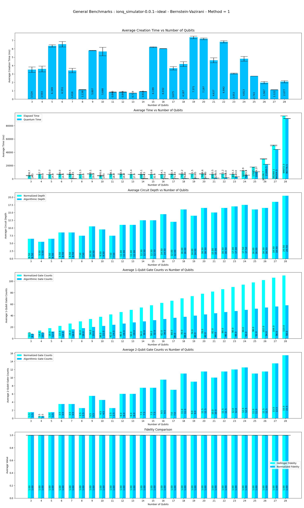
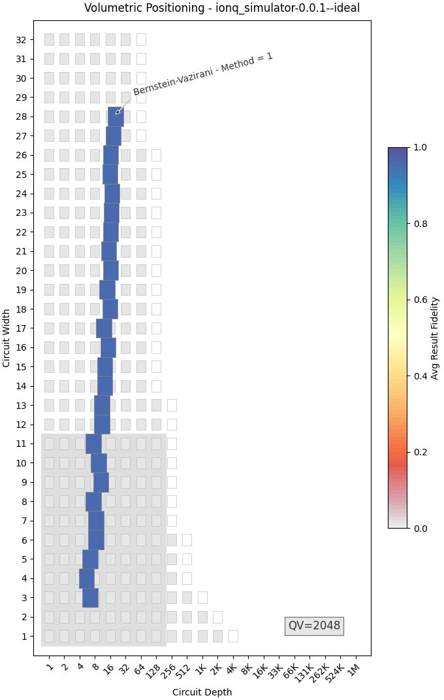
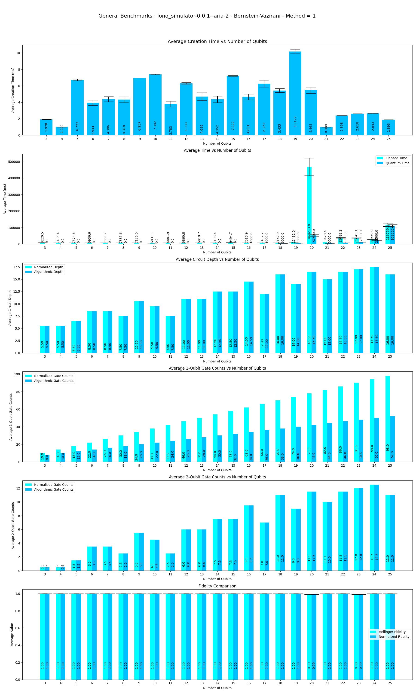
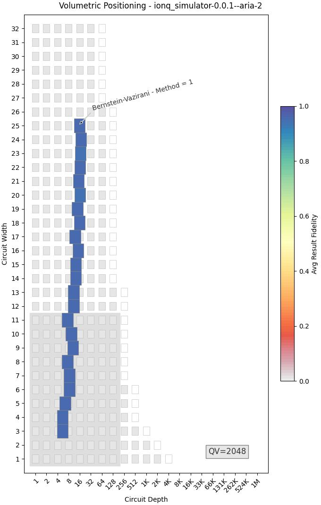
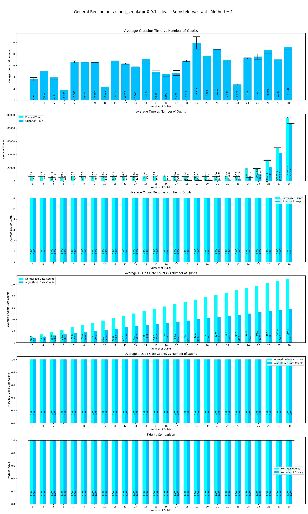
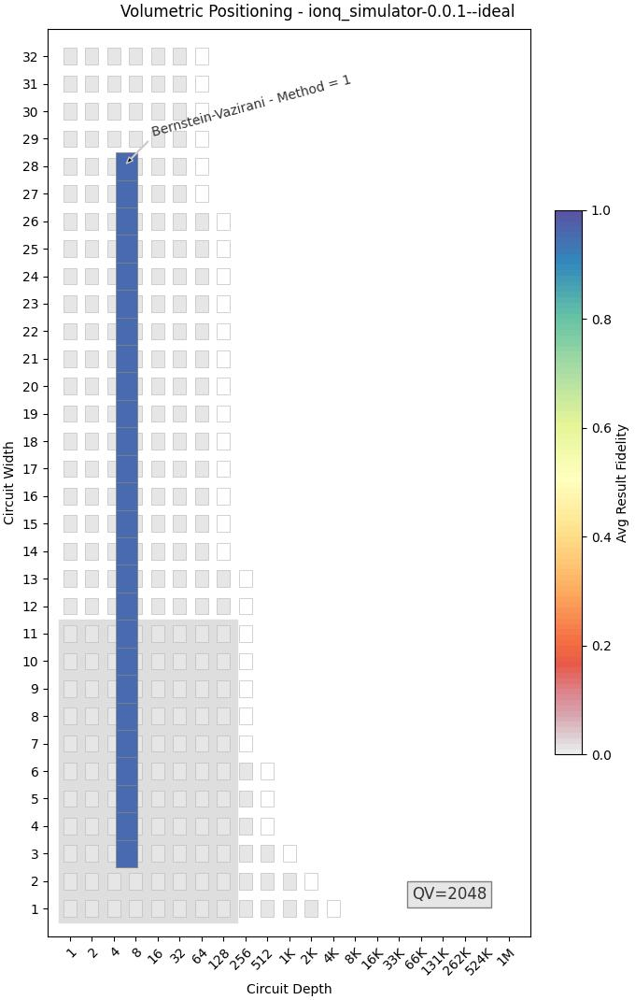

This program performs Benchmarks of **Bernstein-Vazirani** Algorithm on Qiskit-Ionq Providers.

|Platform|Parameters|Noise Parameters|Benchmarks|Volumetric Positioning|Remarks|
|--------|----------|----------------|----------|----------------------|-------|
|ionq_simulator (0.1.1)|min_qubits=3, max_qubits=28, skip_qubits=1, max_circuits=2, num_shots=1000, basis: 1-['rx', 'ry', 'rz', 'cx'], Method = 1, Input_value = None|***ideal***|||Ionq simulator only supports upto **29** qubits. Code is getting failed at **29** Qubits.|
|ionq_simulator (0.1.1)|min_qubits=3, max_qubits=25, skip_qubits=1, max_circuits=2, num_shots=1000, basis: 1-['rx', 'ry', 'rz', 'cx'], Method = 1, Input_value = None|***Aria-2 Noise model***|||Ionq simulator only supports upto **29** qubits. But getting failed at **26** qubits.|
|ionq_simulator (0.1.1)|min_qubits=3, max_qubits=28, skip_qubits=1, max_circuits=2, num_shots=1000, basis: 1-['rx', 'ry', 'rz', 'cx'], Method = 1, Input_value = 2|***ideal***|||Ionq simulator only supports upto **29** qubits. But getting failed at **29** qubits.|
