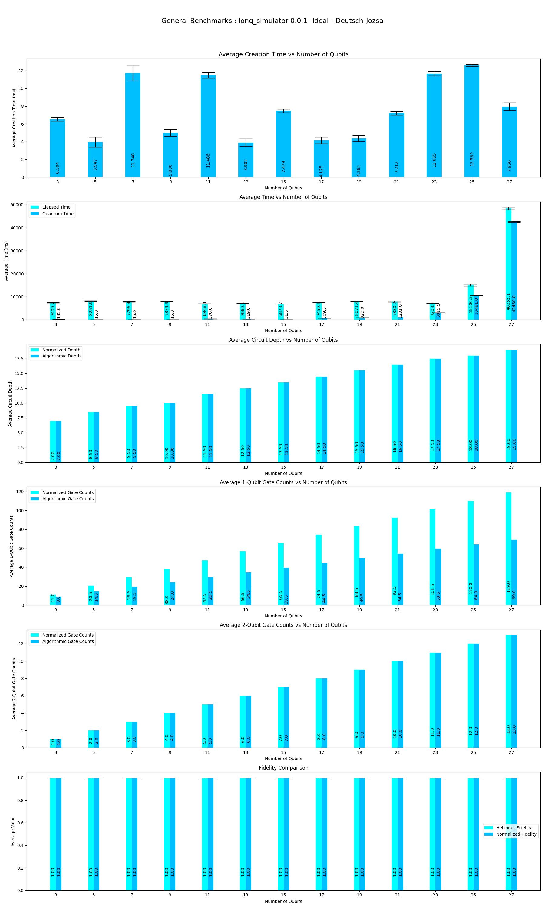
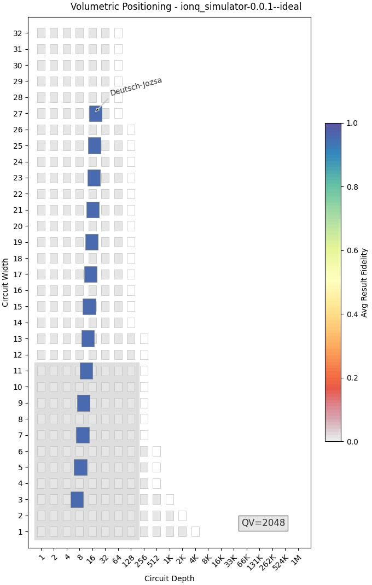
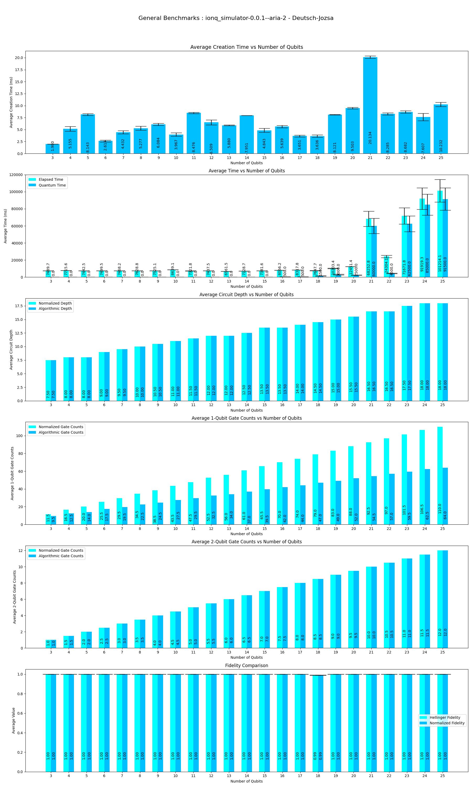
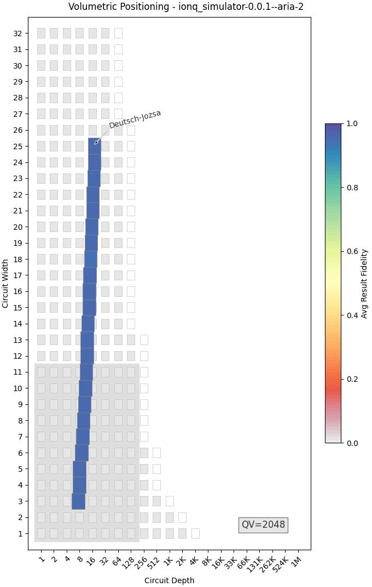
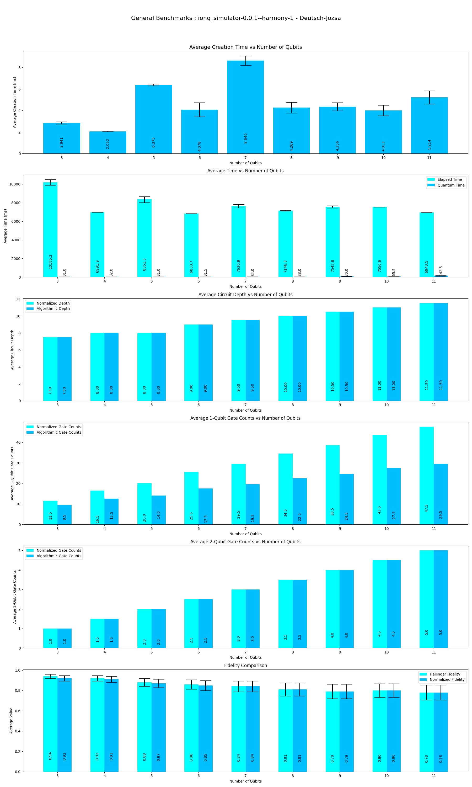
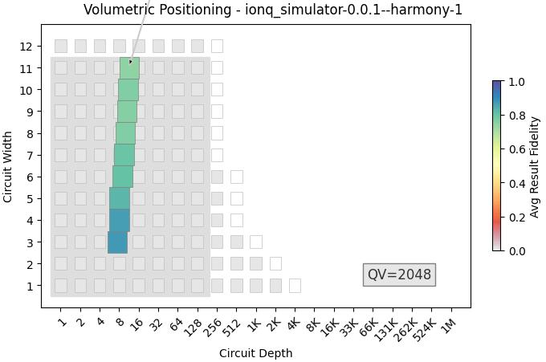

This program performs Benchmarks of **Deutsch-Jozsa** Algorithm on Qiskit-Ionq Providers.

|Platform|Parameters|Noise Parameters|Benchmarks|Volumetric Positioning|Remarks|
|--------|----------|----------------|----------|----------------------|-------|
|ionq_simulator (0.1.1)|min_qubits=3, max_qubits=28, skip_qubits=2, max_circuits=2, num_shots=1000, basis: 1-['rx', 'ry', 'rz', 'cx']|***ideal***|||Ionq simulator only supports upto **29** qubits. Code is getting failed at **29** Qubits. So executed only upto **27** Qubits.|
|ionq_simulator (0.1.1)|min_qubits=3, max_qubits=25, skip_qubits=1, max_circuits=2, num_shots=1000, basis: 1-['rx', 'ry', 'rz', 'cx']|***Aria-2 Noise model***|||Ionq simulator only supports upto **29** qubits. But getting failed at **26** qubits.|
|ionq_simulator (0.1.1)|min_qubits=3, max_qubits=11, skip_qubits=1, max_circuits=2, num_shots=1000, basis: 1-['rx', 'ry', 'rz', 'cx']|***Harmony-1 Noise Model***|||Ionq simulator only supports upto **29** qubits. But simulation getting failed at **12** qubits.|
