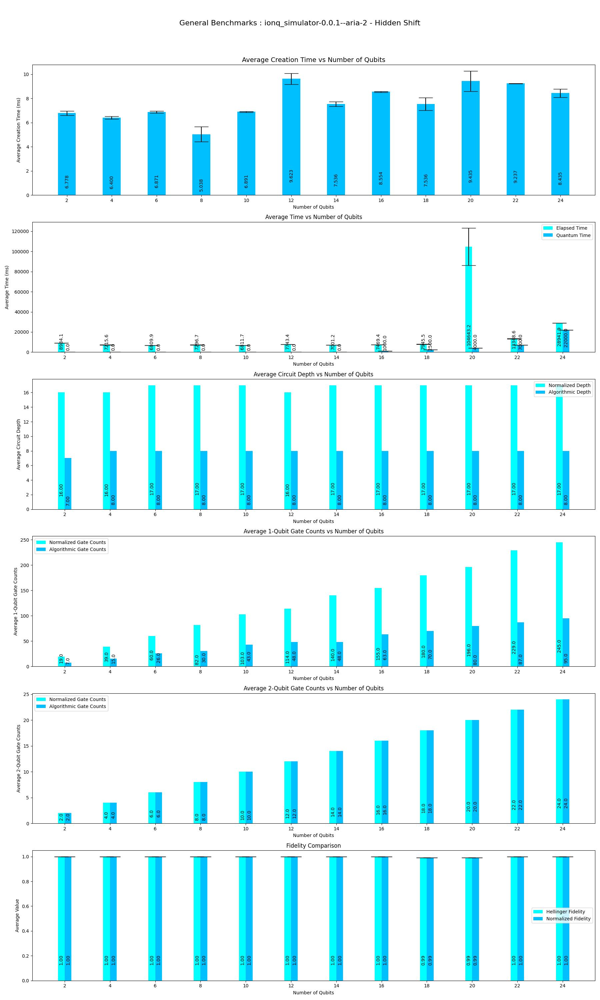

This program performs Benchmarks of **Hidden-Shift** Algorithm on Qiskit-Ionq Providers.

|Platform|Parameters|Noise Parameters|Benchmarks|Volumetric Positioning|Remarks|
|--------|----------|----------------|----------|----------------------|-------|
|ionq_simulator (0.1.1)|min_qubits=3, max_qubits=28, skip_qubits=1, max_circuits=2, num_shots=1000, basis: 1-['rx', 'ry', 'rz', 'cx']|***ideal***|||Ionq simulator only supports upto **29** qubits. Code is getting failed at **29** Qubits. Only even number of Qubits are considered for execution. Circuits with Odd number of Qubits are skipped.|
|ionq_simulator (0.1.1)|min_qubits=2, max_qubits=25, skip_qubits=1, max_circuits=2, num_shots=1000, basis: 1-['rx', 'ry', 'rz', 'cx']|***aria-2 Noise model***|||Ionq simulator only supports upto **29** qubits. Code is getting failed at **26** Qubits. Only even number of Qubits are considered for execution. Circuits with Odd number of Qubits are skipped. so execution is performed only upto **24** qubits.|
|ionq_simulator (0.1.1)|min_qubits=2, max_qubits=11, skip_qubits=1, max_circuits=2, num_shots=1000, basis: 1-['rx', 'ry', 'rz', 'cx']|***harmony Noise model***|||Ionq simulator only supports upto **29** qubits. Code is getting failed at **12** Qubits. Only even number of Qubits are considered for execution. Circuits with Odd number of Qubits are skipped. so execution is performed only upto **10** qubits.|
