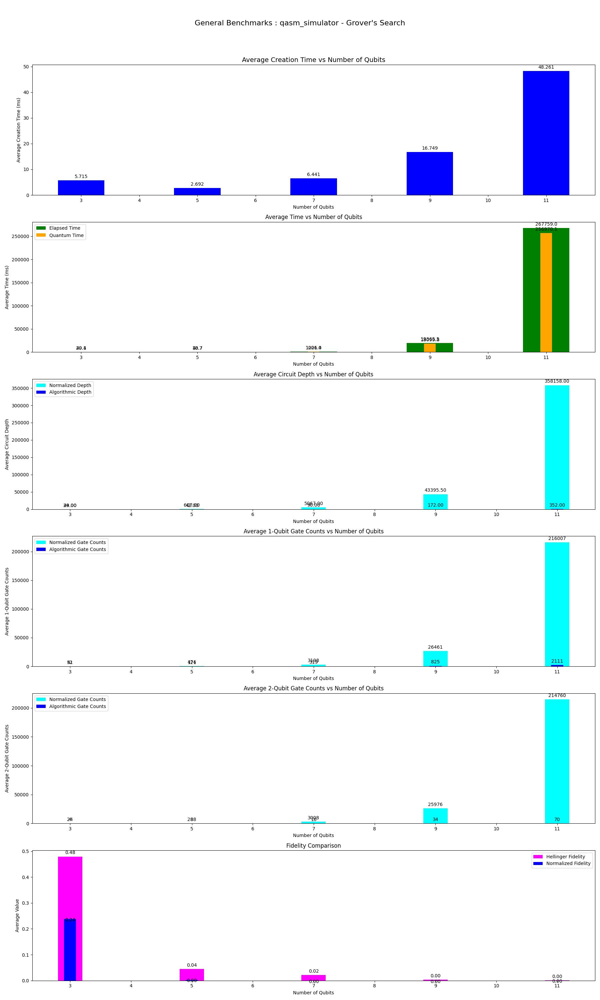
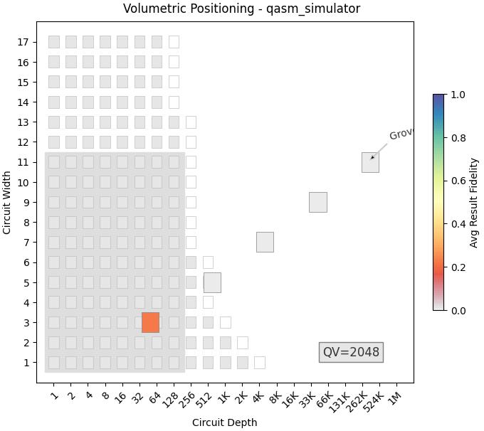

This program performs Benchmarks of **Grover's Search** Algorithm on various simulators provided by **Aer** provider and also includes benchmarks performed with **FakeProviders**.

|Platform|Parameters|Noise Parameters|Benchmarks|Volumetric Positioning|Remarks|
|--------|----------|----------------|----------|----------------------|-------|
|qasm_simulator (0.13.3)|min_qubits=3, max_qubits=13, skip_qubits=2, max_circuits=2, num_shots=1000, basis: 1-['rx', 'ry', 'rz', 'cx']|***ideal***|||Qasm simulator supports upto **31** qubits. But at 15 qubits, overall System's Memory consumption is over **67 GB** so, the process is getting killed.|
|qasm_simulator (0.13.3)|min_qubits=3, max_qubits=11, skip_qubits=2, max_circuits=2, num_shots=1000, basis: 1-['rx', 'ry', 'rz', 'cx']|depol_one_qb_error = 0.05, depol_two_qb_error = 0.005, reset_to_zero_error = 0.005, reset_to_one_error = 0.005|||Qasm simulator only supports upto **31** qubits. But at 13 qubits it is getting failed due to lack of Memory resources.|
|statevector_simulator (0.13.3)|min_qubits=3, max_qubits=14, skip_qubits=1, max_circuits=2, num_shots=1000, basis: 1-['rx', 'ry', 'rz', 'cx']|***ideal***|||Statevector simulator supports upto **31** qubits. But at 15 qubits, overall System's Memory consumption is over **67 GB** so, the process is getting killed.|
