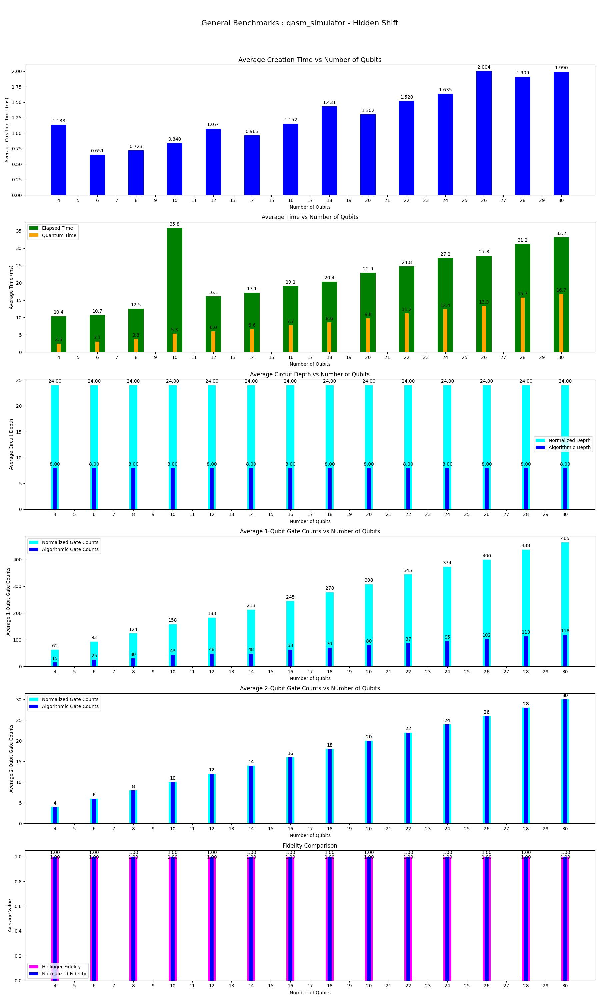
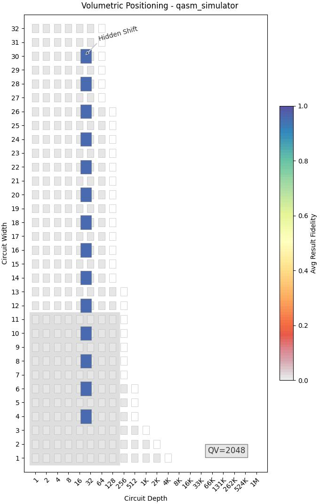
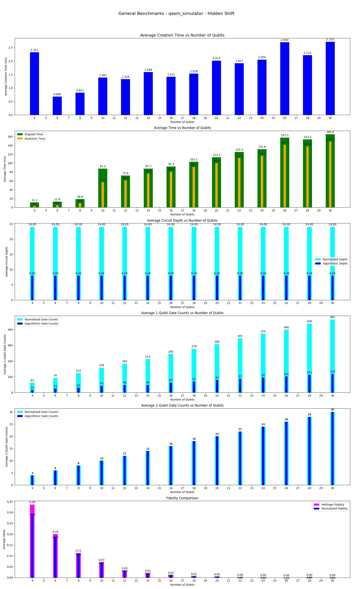
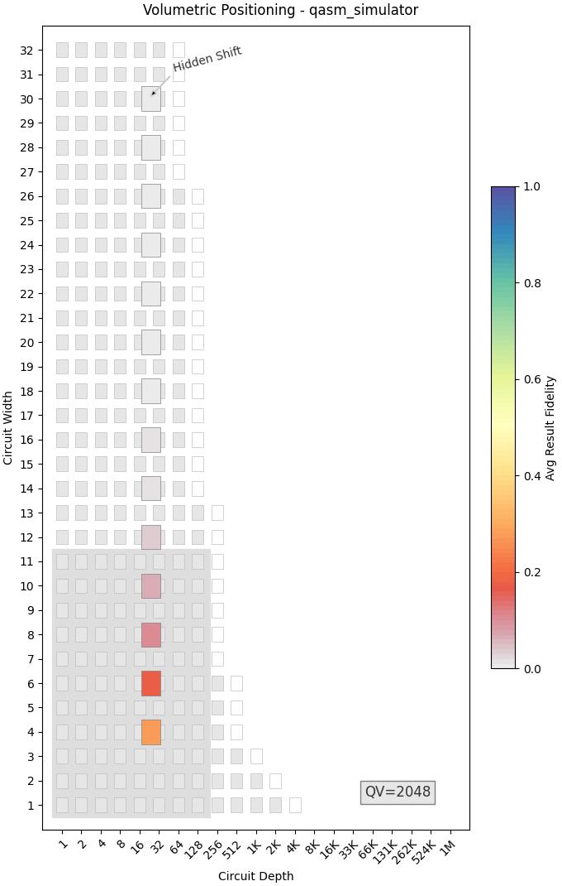
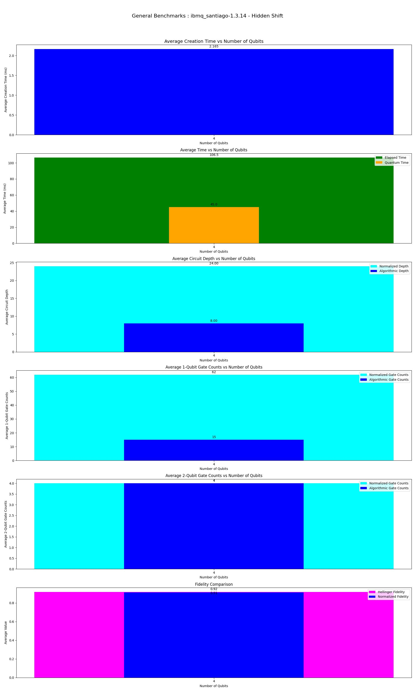
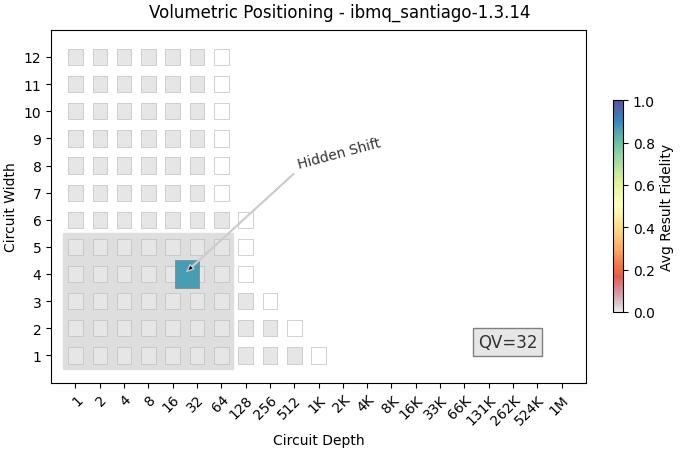
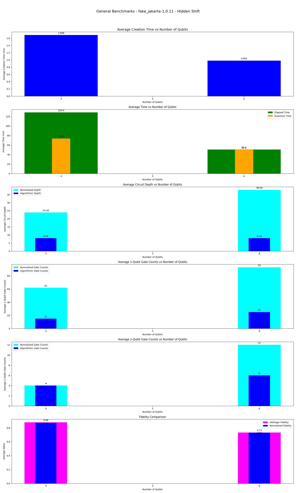
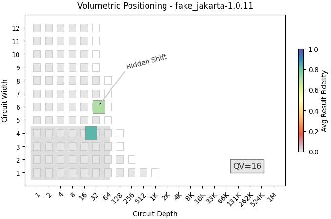

This program performs Benchmarks of **Hidden Shift** Algorithm on various simulators provided by **Aer** provider and also includes benchmarks performed with **FakeProviders**.

In this algorithm even if have given minimum number of qubits as **3** it will consider's it gets increamented by 1 to next even number **4**. And for Skip qubits minimum value will be (by default) **2**. If we give any number **(>2)** then it gets overlapped. If we assign **skip_qubits=1** or lesser then by default it is considered as **2**.

|Platform|Parameters|Noise Parameters|Benchmarks|Volumetric Positioning|Remarks|
|--------|----------|----------------|----------|----------------------|-------|
|qasm_simulator (0.13.3)|min_qubits=3, max_qubits=31, skip_qubits=2(default), max_circuits=2, num_shots=1000, basis: 1-['rx', 'ry', 'rz', 'cx']|***ideal***|||Qasm simulator only supports upto **31** qubits.|
|qasm_simulator (0.13.3)|min_qubits=3, max_qubits=31, skip_qubits=1, max_circuits=2, num_shots=1000,basis: 1-['rx', 'ry', 'rz', 'cx']|depol_one_qb_error = 0.05, depol_two_qb_error = 0.005, reset_to_zero_error = 0.005, reset_to_one_error = 0.005|||Qasm simulator only supports upto **31** qubits.|
|ibmq_athens (1.3.13) **FAKE**|min_qubits=3, max_qubits=5(default), skip_qubits=1, max_circuits=2, num_shots=1000, basis: (default-Provider)|***Provider Preset***|||This is Fake Backend with maximum supported qubits **5**.|
|fake_cambridge (1.2.0) **FAKEV2**|min_qubits=3, max_qubits=28(default), skip_qubits=1, max_circuits=2, num_shots=1000 ,basis: (default-Provider)|***Provider Preset***|||This is Fake Backend *(version-2)* with maximum supported qubits **28**|